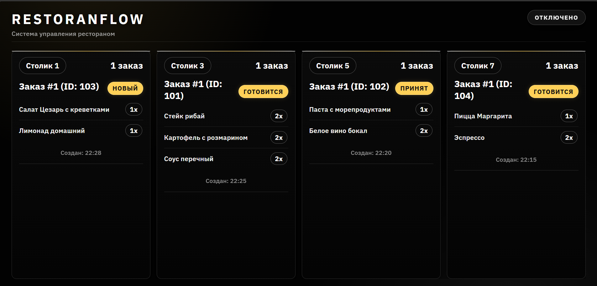

# Restoflow: система управления рестораном

> [!IMPORTANT]
> **Публикация:** здесь размещены описание проекта и демо-материалы для портфолио.  
> **Исходный код в репозиторий не выкладывается** (коммерческая разработка, передача заказчику).

## 💡 Кратко

Restoflow - это система для операционной работы ресторана: мобильное приложение для команды, backend API и TV-display для кухни.

Проект закрывает полный поток обработки заказа: создание, передача на кухню, смена статусов в реальном времени и отображение очереди на экране.

## ✅ Что реализовано

- Мобильные роли: официант, кухня, администратор, директор.
- Работа с заказами: создание, изменение статуса, отмена.
- Realtime-синхронизация между клиентами через WebSocket.
- Отдельный TV-display для кухни с живой очередью заказов.
- Backend API для авторизации, меню, заказов и аналитики.
- Подготовка окружения под production (Docker/Nginx/PostgreSQL/Redis).

## 🔌 API и интеграции

- REST API для мобильного клиента и панели управления.
- Socket.IO / WebSocket для событий `order:new`, `order:updated`, `order:ready`, `order:cancelled`.
- Клиентские экраны подписаны на realtime-события и обновляются без перезагрузки.

## 🧰 Технологии

| Категория | Стек |
|---|---|
| Mobile | React Native, Redux |
| Backend | Node.js, Express |
| Realtime | Socket.IO, WebSocket |
| База данных | PostgreSQL |
| Кэш/очереди | Redis |
| Инфраструктура | Docker, Nginx |

## 📱 Демо приложения (9:16)

<p align="center">
  <video src="./docs/restoflow-github.mp4" controls muted playsinline preload="metadata" width="360"></video>
</p>

Если встроенное видео не отображается, открой напрямую: [`docs/restoflow-github.mp4`](./docs/restoflow-github.mp4)

> [!NOTE]
> Встроенный плеер GitHub иногда воспроизводит видео с лагами из-за стриминга и ограничений браузера.
> Полная версия (исходное качество, без дополнительного сжатия): [`docs/restoflow-full.mp4`](./docs/restoflow-full.mp4)

## 🖥️ TV-display (кухня)

<p align="center">
  
</p>

## 🤝 Роль и формат работы

Коммерческий проект под задачи ресторанного бизнеса: реализация по ТЗ, итеративные доработки, настройка окружения и сопровождение запуска.

## 📁 Материалы

Медиафайлы находятся в `docs/`:
- `docs/restoflow.mp4`
- `docs/restoflow-full.mp4`
- `docs/restoflow-smooth.mp4`
- `docs/restoflow-github.mp4`
- `docs/restoflow-lite.mp4`
- `docs/restoflow-demo.gif`
- `docs/tvdisplay.png`

### Рекомендованный экспорт через FFmpeg (плавно и качественно)

```bash
ffmpeg -i input.mp4 -vf "fps=60,scale=1080:-2:flags=lanczos,format=yuv420p" -c:v libx264 -profile:v high -level 5.2 -preset slow -crf 18 -movflags +faststart docs/restoflow-smooth.mp4
```

Для GitHub (максимально плавно в веб-плеере, меньше лагов):

```bash
ffmpeg -i input.mp4 -vf "fps=60,scale=720:-2:flags=lanczos,format=yuv420p" -c:v libx264 -preset medium -crf 20 -profile:v high -level 4.1 -tune fastdecode -x264-params "keyint=120:min-keyint=120:scenecut=0:ref=3" -movflags +faststart docs/restoflow-github.mp4
```

Если всё ещё подлагивает на слабых устройствах/сети:

```bash
ffmpeg -i input.mp4 -vf "fps=60,scale=540:-2:flags=lanczos,format=yuv420p" -c:v libx264 -preset veryfast -crf 23 -maxrate 900k -bufsize 1800k -profile:v high -level 4.0 -x264-params "keyint=60:min-keyint=60:scenecut=0:ref=2:bframes=2" -movflags +faststart docs/restoflow-lite.mp4
```

Для GIF-превью (если нужно именно GIF):

```bash
ffmpeg -ss 00:00:02 -t 00:00:14 -i docs/restoflow-smooth.mp4 -vf "fps=30,scale=432:-1:flags=lanczos,split[s0][s1];[s0]palettegen=max_colors=256[p];[s1][p]paletteuse=dither=sierra2_4a" -loop 0 docs/restoflow-demo.gif
```

## ⚠️ Лицензия и доступ

> [!CAUTION]
> Репозиторий создан как портфолио-кейс.  
> Копирование или использование исходного кода третьими лицами из этого репозитория не предполагается (кода в публичном доступе нет).
