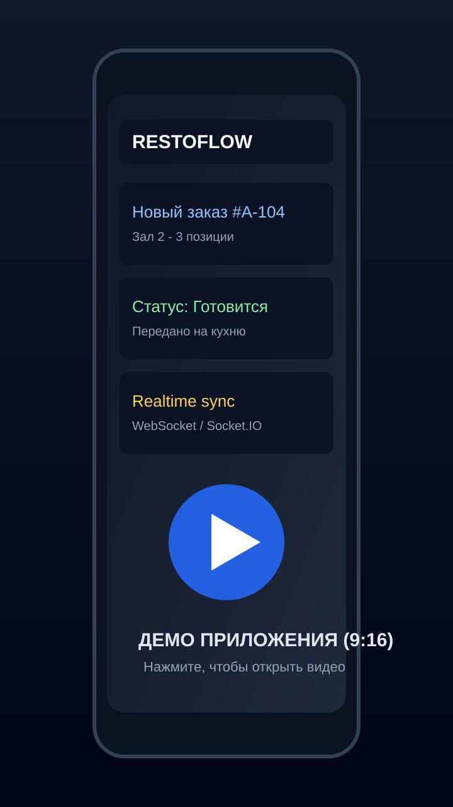

# Restoflow: система управления рестораном

> [!IMPORTANT]
> **Публикация:** здесь размещены описание проекта и демо-материалы для портфолио.  
> **Исходный код в репозиторий не выкладывается** (коммерческая разработка, передача заказчику).

## 💡 Кратко

Restoflow - это система для операционной работы ресторана: мобильное приложение для команды, backend API и TV-display для кухни.

Проект закрывает полный поток обработки заказа: создание, передача на кухню, смена статусов в реальном времени и отображение очереди на экране.

## ✅ Что реализовано

- Мобильные роли: официант, кухня, администратор, директор.
- Работа с заказами: создание, изменение статуса, отмена.
- Realtime-синхронизация между клиентами через WebSocket.
- Отдельный TV-display для кухни с живой очередью заказов.
- Backend API для авторизации, меню, заказов и аналитики.
- Подготовка окружения под production (Docker/Nginx/PostgreSQL/Redis).

## 🔌 API и интеграции

- REST API для мобильного клиента и панели управления.
- Socket.IO / WebSocket для событий `order:new`, `order:updated`, `order:ready`, `order:cancelled`.
- Клиентские экраны подписаны на realtime-события и обновляются без перезагрузки.

## 🧰 Технологии

| Категория | Стек |
|---|---|
| Mobile | React Native, Redux |
| Backend | Node.js, Express |
| Realtime | Socket.IO, WebSocket |
| База данных | PostgreSQL |
| Кэш/очереди | Redis |
| Инфраструктура | Docker, Nginx |

## 📱 Демо приложения (9:16)

  

  <a href="./docs/restoflow.mp4"><b>▶ Смотреть демо-видео</b></a>

## 🖥️ TV-display (кухня)

  

## 🤝 Роль и формат работы

Коммерческий проект под задачи ресторанного бизнеса: реализация по ТЗ, итеративные доработки, настройка окружения и сопровождение запуска.

## 📁 Материалы

Медиафайлы находятся в `docs/`:
- `docs/restoflow.mp4`
- `docs/tvdisplay.png`

## ⚠️ Лицензия и доступ

> [!CAUTION]
> Репозиторий создан как портфолио-кейс.  
> Копирование или использование исходного кода третьими лицами из этого репозитория не предполагается (кода в публичном доступе нет).
